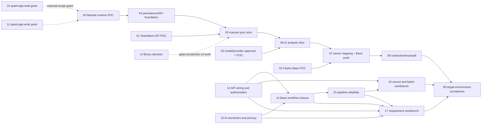

# RQ-Sys MVP — Ticket Drafts

来源：`specs/rq-sys-mvp/`，以当前 PRD revision 60 为产品行为基线。此处是本地待评审 ticket 草案，尚未发布到外部 tracker。

Agent 可直接使用的总任务说明：[`../AGENT-HANDOFF.md`](../AGENT-HANDOFF.md)。

技术栈建议见 [`../../../specs/rq-sys-mvp/TECHNICAL-PLAN-MIAODA.md`](../../../specs/rq-sys-mvp/TECHNICAL-PLAN-MIAODA.md)；首个 POC 需核对 GitHub 仓库与妙搭之间的代码导入/发布方式。

## 建议顺序

先并行验证外部依赖，再按纵向切片开发：

## Ticket list

| ID | Ticket | Status | Depends on |
|---|---|---|---|
| 00 | Miaoda runtime capability POC | partially-available（2026-10-09 app_17fqkjwyx1u: list/get 可用；dev schema/changelog/quota 查询可用且 13 张表已存在；dev env-list 空；automation-list 空；member-settings-get 对该 app 返回 feature_not_available。PostgreSQL runtime/backup、job recovery、secret injection、online observability/retention/UI hosting/HeroUI 仍未验证） | — |
| 01 | Teambition API and field mapping POC | done（2026-10-08，证据：specs/rq-sys-mvp/TEAMBITION-LIVE-POC.md；仍跟踪其中标注的持续观察项） | — |
| 02 | Feishu Base schema, upsert, and automation POC | done（2026-10-08，证据：specs/rq-sys-mvp/FEISHU-BASE-POC.md） | — |
| 03 | AI provider and data-policy decision/POC | done（2026-10-08 离线校验 5/5 + 超时/无效 key 在线实测 + PII 掩码断言；2026-10-09 有效 key 补跑 T1–T3 全部通过 + 生产适配器冒烟通过并修复 factory env 断链/prompt 样例缺失，证据：specs/rq-sys-mvp/AI-ANALYSIS-POC.md） | D-06 已确认；T1–T3 已验证 |
| 04 | Persisted domain model and server API foundation | implemented-not-target-verified (local persisted model, PostgreSQL adapters, migrations, OpenAPI and business HTTP handlers are implemented; target Miaoda DB/runtime/identity validation remains blocked on Ticket 00) | 00 |
| 05 | Manual Teambition sync vertical slice | implemented-not-target-verified（本地开发项已实现，2026-10-09 API 170/170、Web 13/13、typecheck/build 通过；但 MVP 真实手动同步切片仍 blocked：妙搭未部署 RQ-Sys API、dev 未配身份/网关变量/source config，未从目标 app 发起 sync；不得将本地代码标作已接入） | 00, 01, 04, D-08 |
| 06 | AI analysis vertical slice | blocked | 03, 05 |
| 07 | Owner mapping and Feishu Base push vertical slice | blocked | 02, 05 |
| 08 | Weekly schedule, retry, and audit | blocked (2026-10-09 current app check: `app_17fqkjwyx1u` has no automation triggers; no scheduled worker execution or target audit-persistence/recovery acceptance evidence; local worker groundwork only) | 00, 05, 06, 07 |
| 09 | Target-environment end-to-end acceptance | blocked (read-only checkpoint 2026-10-09: app `app_17fqkjwyx1u` latest finished release is scaffold UI commit `1a2910b`, not RQ-Sys implementation; dev schema has 13 empty tables; env-list empty; no automations; collaborator-settings API unavailable for this app type; no target E2E path exercised) | 00–08, 12–17, external gates 10–11 |
| D-08 | Resolve production UI component baseline after repo inspection | resolved（2026-10-08，ADR-001：基线已推送（main，03aef74）并检视——仓库无 UI 依赖，按 design.md 采用 HeroUI v3 + Tailwind；UI 托管方式留待 00） | ADR-001 已产出 |
| 10 | Grant `spark:app:read` user scope for Miaoda apps | resolved（2026-10-09 根因确认：TraeWork 注入的凭证环境变量（LARKSUITE_CLI_APP_ID/USER_ACCESS_TOKEN/BRAND）缺少 spark 权限并遮蔽本地已授权配置；解法为所有妙搭命令加 `env -u` 前缀回退本地配置。`apps +list/+get/+release-list/+release-get` 已验证通过（identity=user，目标 app_17fqkjwyx1u 返回）；后续 +member 复测见工单） | — |
| 11 | Grant `spark:app:write` user scope for Miaoda apps | ready-for-agent（2026-10-09 通道更新：根因同工单 10（注入凭证遮蔽），同一 `env -u` 前缀规则下写 scope 推断可用、待写验证实测；需用户指定安全测试目标并遵守高风险门禁 dry-run → 确认 → --yes） | 用户指定安全测试目标 |
| 12 | API wiring, role enforcement, and source setup | implemented-not-target-verified（2026-10-09 本地完成：规则仓储/HTTP 装配修复、服务端角色矩阵（manage_config/manage_rules/operate）覆盖全部写端点、POST /api/sources 单一来源受控创建 + strict 白名单拒绝凭据字段、审计写失败不返回虚假成功；测试 auth-source.test.ts + typecheck/build 通过。目标妙搭身份适配仍依赖 Ticket 00） | — |
| 13 | AI output semantics, priority rules, and privacy | implemented-not-target-verified（2026-10-09 本地完成：移除证据计数公式，规则 JSON 改为显式 U/M/S/C 评分映射 + 阈值，未发布/未校准规则时 priority 保持 null（buildPriorityRule 返回 null，取值不在映射中不猜测）；maskPii 增补身份证/24 位平台用户 ID/@提及；outbound payload 无姓名/用户 ID/联系方式/凭据的断言测试通过。provider target acceptance remains Ticket 09） | 03 |
| 14 | Complete analysis-to-Base push workflow | implemented-not-target-verified（2026-10-09 本地完成：分析首次终态后 pipeline/advance.ts 按负责人规则推进（无负责人→not_required 直接入队；映射唯一→auto_mapped；未匹配→等待人工映射不入队），AI 失败/低置信度/空优先级不阻塞；push-service 映射最新分析版本 AI 字段（P0–P3 原样传递，priority null 不写字段），TB 有负责人未匹配时拒绝推送并审计 denied；PM 快照仅当源版本新于上次推送版本；人工映射先持久化再入队。真实 Base acceptance remains Ticket 09） | 02, 12, 13 |
| 15 | Pipeline idempotency, retry, and worker fencing | implemented-not-target-verified（2026-10-09 本地完成：complete/reschedule 增加 expectedAttempt fencing（过期 worker 迟到结果被拒绝且不覆盖新状态，Postgres 集成测试覆盖租约过期重认领场景）；失败推送可安全重试（failed→running 合法迁移 + 幂等键复用既有行）；sync/run 与 items retry 入队失败时批次标记 failed 并支持同幂等键恢复，不留 running 孤儿批次。妙搭调度接线 remains Ticket 00/09） | 12, 14 |
| 16 | Source settings and batch workbench | implemented-not-target-verified（2026-10-09 本地完成：Sources 页创建/更新单一来源（保存后从 API 重读一致、403 显示权限状态）、Batches 页触发者/触发方式展示 + 批次详情逐条结果 + 失败项重试；组件测试覆盖保存重读/权限拒绝/详情重试（panels.test.tsx）） | 12, 15 |
| 17 | Requirement, owner mapping, retry, and audit workbench | implemented-not-target-verified（2026-10-09 本地完成：需求池 ownerState/analysisState 服务端筛选 + 详情（源快照版本/AI 建议与 PM 字段分开/四阶段状态）+ 分析重试/推送重试；Mappings 页待匹配列表 + 选择飞书用户保存并入队推送；Audit 页按对象 ID 服务端筛选展示 actor/动作/结果/安全摘要；推送成功不声称通知已送达。目标飞书用户搜索/映射权限需 Ticket 09 真实环境验收） | 12–15 |

`ready-for-agent` 表示可开始做 POC/决策工作，不代表生产集成已具备条件。具体 blocker 在各 ticket 中列出。全生命周期 28 字段不属于这些 tickets。

Tickets 12–17 are the prioritized remaining local-development slices. Tickets 00, 10, and 11 remain external capability/permission gates; do not claim target acceptance until Ticket 09 passes. The new tickets are local drafts and have not been published to an external tracker.
