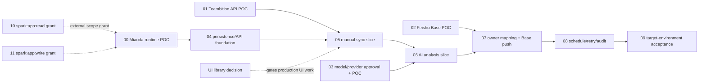

# RQ-Sys MVP — Ticket Drafts

来源：`specs/rq-sys-mvp/`，以当前 PRD revision 60 为产品行为基线。此处是本地待评审 ticket 草案，尚未发布到外部 tracker。

技术栈建议见 [`../../../specs/rq-sys-mvp/TECHNICAL-PLAN-MIAODA.md`](../../../specs/rq-sys-mvp/TECHNICAL-PLAN-MIAODA.md)；首个 POC 需核对 GitHub 仓库与妙搭之间的代码导入/发布方式。

## 建议顺序

先并行验证外部依赖，再按纵向切片开发：

## Ticket list

| ID | Ticket | Status | Depends on |
|---|---|---|---|
| 00 | Miaoda runtime capability POC | partially-available（2026-10-08 本地 Spark app list/get 可用；member-list 对现有 frontend app 返回 feature_not_available；目标 RQ-Sys 应用/运行时仍未验证） | — |
| 01 | Teambition API and field mapping POC | done（2026-10-08，证据：specs/rq-sys-mvp/TEAMBITION-LIVE-POC.md） | — |
| 02 | Feishu Base schema, upsert, and automation POC | done（2026-10-08，证据：specs/rq-sys-mvp/FEISHU-BASE-POC.md） | — |
| 03 | AI provider and data-policy decision/POC | poc-verified-partial（2026-10-08：离线校验 5/5 + 超时/无效 key 在线实测 + PII 掩码断言通过，证据：specs/rq-sys-mvp/AI-ANALYSIS-POC.md；在线 T1–T3 待有效测试 key 补跑） | D-06 已确认；T1–T3 待 key |
| 04 | Persisted domain model and server API foundation | blocked (local API foundation/tests/runbook updated; business APIs and target Miaoda validation remain blocked on 00) | 00 |
| 05 | Manual Teambition sync vertical slice | blocked | 00, 01, 04, D-08 |
| 06 | AI analysis vertical slice | blocked | 03, 05 |
| 07 | Owner mapping and Feishu Base push vertical slice | blocked | 02, 05 |
| 08 | Weekly schedule, retry, and audit | blocked (local pure-code groundwork approved; scheduler/retry/audit implementation and target Miaoda acceptance still pending) | 00, 05, 06, 07 |
| 09 | Target-environment end-to-end acceptance | blocked | 00–08 |
| D-08 | Resolve production UI component baseline after repo inspection | resolved（2026-10-08，ADR-001：基线已推送（main，03aef74）并检视——仓库无 UI 依赖，按 design.md 采用 HeroUI v3 + Tailwind；UI 托管方式留待 00） | ADR-001 已产出 |
| 10 | Grant `spark:app:read` user scope for Miaoda apps | blocked（2026-10-08 TRAE 托管授权侧报告该 scope 暂不支持；本地 CLI `apps +list` 现可读，应用列表读验证通过；协作者读取单项返回 feature_not_available，与 missing_scope 不同） | TRAE 授权服务/托管凭证侧；更细资源读取取决于应用类型/平台支持 |
| 11 | Grant `spark:app:write` user scope for Miaoda apps | blocked（未对指定测试应用执行写权限验证；TRAE 托管授权侧报告该 scope 暂不支持，等外部开通与用户指定安全测试目标） | 同 Ticket 10 通道，可与之一并开通；agent 仅负责验收 |

`ready-for-agent` 表示可开始做 POC/决策工作，不代表生产集成已具备条件。具体 blocker 在各 ticket 中列出。全生命周期 28 字段不属于这些 tickets。
