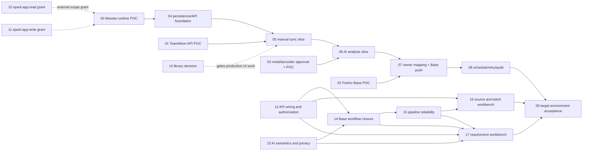

# RQ-Sys MVP — Ticket Drafts

来源：`specs/rq-sys-mvp/`，以当前 PRD revision 60 为产品行为基线。此处是本地待评审 ticket 草案，尚未发布到外部 tracker。

Agent 可直接使用的总任务说明：[`../AGENT-HANDOFF.md`](../AGENT-HANDOFF.md)。

技术栈建议见 [`../../../specs/rq-sys-mvp/TECHNICAL-PLAN-MIAODA.md`](../../../specs/rq-sys-mvp/TECHNICAL-PLAN-MIAODA.md)；首个 POC 需核对 GitHub 仓库与妙搭之间的代码导入/发布方式。

## 建议顺序

先并行验证外部依赖，再按纵向切片开发：

## Ticket list

| ID | Ticket | Status | Depends on |
|---|---|---|---|
| 00 | Miaoda runtime capability POC | partially-available（release `7695216916613073890` 已发布；dev 环境 POC Base/fixture 变量已设置；来源写请求被目标 dev 返回 `FORBIDDEN`，目标端写入、模型、队列恢复与通知待验收。） | — |
| 01 | Teambition API and field mapping POC | partially verified（固定项目返回 311 条、需求 ID 唯一。MVP 最小映射已定；自定义字段类型/需求类型绑定未核实，因此不进入分析或 Base。） | — |
| 02 | Feishu Base schema, upsert, and automation POC | partially verified（安全 POC Base 字段类型和负责人变更通知流程已只读核验；本地 adapter 回归通过。妙搭 app-mediated 写入/仅通知用户本人尚未执行；正式表优先级选项仅 P0/P1/P2。） | — |
| 03 | AI provider and data-policy decision/POC | done（2026-10-08 离线校验 5/5 + 超时/无效 key 在线实测 + PII 掩码断言；2026-10-09 有效 key 补跑 T1–T3 全部通过 + 生产适配器冒烟通过并修复 factory env 断链/prompt 样例缺失，证据：specs/rq-sys-mvp/AI-ANALYSIS-POC.md） | D-06 已确认；T1–T3 已验证 |
| 04 | Persisted domain model and server API foundation | implemented-not-target-verified（本地 schema/adapters/API 已覆盖；Miaoda online schema 和 source-config 读路径曾确认，target write/transaction 仍待本次发布后的安全验收） | 00 |
| 05 | Manual Teambition sync vertical slice | implemented-not-target-verified（项目名解析和本地同步流程实现；安全验收使用固定 synthetic fixture，不能抓取正式项目需求） | 00, 01, 04, D-08 |
| 06 | AI analysis vertical slice | implemented-not-target-verified（provider、结构化输出、存储和重试本地实现；目标 runtime 模型调用待安全 fixture 验证） | 03, 05 |
| 07 | Owner mapping and Feishu Base push vertical slice | implemented-not-target-verified（Owner UI/API 和 Base adapter 已有本地回归；需要 dev 指向 POC Base 后执行 app-mediated upsert） | 02, 05 |
| 08 | Weekly schedule, retry, and audit | implemented-not-target-verified（持久 due-job 与受限队列 drain、恢复 handler 已实现；用户选择周一 09:00 Asia/Shanghai。目标 30 分钟 recovery trigger 已创建但保持 disabled，尚未验证运行时恢复。） | 00, 05, 06, 07 |
| 09 | Target-environment end-to-end acceptance | blocked（release、dev POC 配置、disabled recovery trigger 已准备。**FORBIDDEN 归因已修正（2026-10-11 历史回溯）**：403 是服务端返回的，但“角色校验由服务端强制执行”是**客户端硬编码文案**，存在于未发布构建（`1deb70d`…`be2d20a`、`b2ea3d8`）；已发布 `87a2444` 已改为“飞书平台或集成服务拒绝了此请求”，且**服务端任何提交都没有 RQ-Sys 角色逻辑**（`87a2444` 的 `server/rqsys/http/app.ts` 中 `forbid\|role` 计数为 0）。故这不是平台 ACL 拦截，而是 dev preview 运行了旧客户端构建。下一步：把 dev 工作区对齐到 `87a2444`（保留既有 `.env` 与 `server/database/schema.ts` 改动）后重试创建来源；若仍 403，按新文案核查飞书平台/集成资源授权与运行 commit。未创建来源/批次，故未调用模型、写 Base 或发送通知。） | 00–08, 12–17 |
| D-08 | Resolve production UI component baseline after repo inspection | resolved（2026-10-08，ADR-001：基线已推送（main，03aef74）并检视——仓库无 UI 依赖，按 design.md 采用 HeroUI v3 + Tailwind；UI 托管方式留待 00） | ADR-001 已产出 |
| 10 | Grant `spark:app:read` user scope for Miaoda apps | resolved（2026-10-09 根因确认：TraeWork 注入凭证遮蔽本地授权；加 `env -u LARKSUITE_CLI_APP_ID -u LARKSUITE_CLI_USER_ACCESS_TOKEN -u LARKSUITE_CLI_BRAND` 后 apps +list/+get/release 与 observability 命令调用成功。member APIs 仍为 feature_not_available；观测数据部分为空/null，详见工单 evidence） | — |
| 11 | Grant `spark:app:write` user scope for Miaoda apps | resolved（2026-10-09 双路径验证：member-add 路径返回 feature_not_available 3340005（该 full_stack app 不支持 CLI 协作者管理，非 scope 问题）；**release-create 路径验证通过**——同一 env -u 前缀下 `+release-create --branch sprint/default --apply-reason` 真实发布成功，release 7694661855108893966 publishing→finished、error_logs 空、无 missing_scope（方案A，用户显式确认；命令 Risk: write 无 --yes 门禁）。spark:app:write 对发布类写操作可用） | — |
| 12 | API wiring, login-only access, and source setup | implemented-not-target-verified（代码要求登录、不实现 RQ-Sys app 角色；但 dev `POST /api/sources` 返回 `FORBIDDEN` 并提示服务端角色校验，需核实目标 runtime/ACL 是否与发布 commit 一致。） | — |
| 13 | AI output semantics, priority rules, and privacy | implemented-not-target-verified（2026-10-09 本地完成：移除证据计数公式，规则 JSON 改为显式 U/M/S/C 评分映射 + 阈值，未发布/未校准规则时 priority 保持 null（buildPriorityRule 返回 null，取值不在映射中不猜测）；maskPii 增补身份证/24 位平台用户 ID/@提及；outbound payload 无姓名/用户 ID/联系方式/凭据的断言测试通过。provider target acceptance remains Ticket 09） | 03 |
| 14 | Complete analysis-to-Base push workflow | implemented-not-target-verified（本地分析终态后推进、失败/低置信度不阻塞推送、快照/映射顺序均有实现；目标 app TLS、身份、Base 凭据/夹具仍未验证） | 02, 12, 13 |
| 15 | Pipeline idempotency, retry, and worker fencing | implemented-not-target-verified（worker fencing/retry 本地验证通过；online Miaoda runtime、durable worker restart、schedule trigger 尚未实测） | 12, 14 |
| 16 | Source settings and batch workbench | implemented-not-target-verified（2026-10-11 补齐 Spec 04 缺口：Dashboard 调度状态卡片（按业务时区纯计算下次计划时刻；非法时区报错而不回退机器本地时区；明确不宣称目标环境已执行）；Source 连接自检（仅展示已保存配置完整性，**不显示凭据值、也不输出凭据有效/无效结论**——Spec 04 的凭据 self-check 目前无 API 契约）；需求详情 Base 记录改为可复制引用并说明 PM 状态需在 Base 查看（不伪造打不开的链接）。403 文案按「登录即可用、无应用角色」模型修正。Web 测试 21→36 通过；typecheck/build/git diff --check 通过。目标 login identity、trace-to-release correlation、真实凭据连通性探测、授权测试夹具仍待办） | 12, 15 |
| 17 | Requirement, owner mapping, retry, and audit workbench | implemented-not-target-verified（本地需求池/详情/重试/审计已接 API；详情现在展示 U/M/S/C 建议、理由、证据和缺证标记；目标身份、飞书通讯录和 Base 权限仍未实测。匹配推送不得等同通知送达） | 12–15 |

`ready-for-agent` 表示可开始做 POC/决策工作，不代表生产集成已具备条件。具体 blocker 在各 ticket 中列出。全生命周期 28 字段不属于这些 tickets。

Tickets 04–08 and 12–17 have local implementations but remain unverified in the target environment. Root GitHub `main` commit `5790d80` and nested Miaoda `sprint/default` commit `87a2444` are pushed as separate repositories. Release `7695216916613073890` is finished; dev-only POC Base/fixture variables are set, and the 30-minute recovery trigger exists but is disabled. Product decision: login is required; there are no RQ-Sys roles or per-user permissions. The published 分类规则 page readback shows no module dictionary or priority-rule versions. MVP source mapping and empty-by-default module dictionary are recorded in `specs/rq-sys-mvp/TEAMBITION-LIVE-POC.md`. Safe acceptance must use the POC Base plus fixed synthetic fixture; do not write to the formal Base. Dev source creation was refused with `FORBIDDEN`; no source/batch was created, so no target model call, app-mediated Base write, or notification has been verified. Resolve the target runtime/ACL discrepancy before retrying; do not bypass the server refusal.
