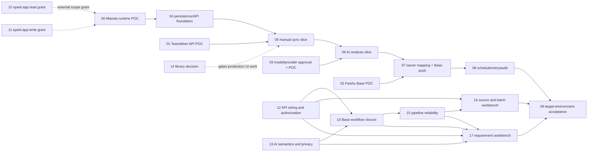

# RQ-Sys MVP — Ticket Drafts

来源：`specs/rq-sys-mvp/`，以当前 PRD revision 60 为产品行为基线。此处是本地待评审 ticket 草案，尚未发布到外部 tracker。

Agent 可直接使用的总任务说明：[`../AGENT-HANDOFF.md`](../AGENT-HANDOFF.md)。

技术栈建议见 [`../../../specs/rq-sys-mvp/TECHNICAL-PLAN-MIAODA.md`](../../../specs/rq-sys-mvp/TECHNICAL-PLAN-MIAODA.md)；首个 POC 需核对 GitHub 仓库与妙搭之间的代码导入/发布方式。

## 建议顺序

先并行验证外部依赖，再按纵向切片开发：

## Ticket list

| ID | Ticket | Status | Depends on |
|---|---|---|---|
| 00 | Miaoda runtime capability POC | partially-available（2026-10-10: release `7694878567301549280` / `be2d20a` finished; fresh authenticated workbench reads show health/source GETs succeed and source list is empty, verifying the current DB read path. Historical TLS 500 belongs to old `6773cc4`; trace-to-live-commit correlation awaits DNS/observability. Identity, secrets, external integrations, and durable scheduler remain unverified.） | — |
| 01 | Teambition API and field mapping POC | partially verified（旧 POC 对应另一项目；2026-10-10 只读 skill 查询确认项目 `室外产品-码表软固件需求池` / `6960a3187384fa11aa07d7e6`、需求类型 ID `6960a3b76586dfa001dc14df` 和全部 16 个自定义字段 ID/名称；字段类型/选项/类型绑定、原始记录数/分页和 MVP 映射仍待验证） | — |
| 02 | Feishu Base schema, upsert, and automation POC | done（2026-10-08，证据：specs/rq-sys-mvp/FEISHU-BASE-POC.md） | — |
| 03 | AI provider and data-policy decision/POC | done（2026-10-08 离线校验 5/5 + 超时/无效 key 在线实测 + PII 掩码断言；2026-10-09 有效 key 补跑 T1–T3 全部通过 + 生产适配器冒烟通过并修复 factory env 断链/prompt 样例缺失，证据：specs/rq-sys-mvp/AI-ANALYSIS-POC.md） | D-06 已确认；T1–T3 已验证 |
| 04 | Persisted domain model and server API foundation | implemented-not-target-verified (PostgreSQL schema/adapters and business handlers implemented locally; Miaoda-managed online schema and source-config read path are confirmed, but target writes/transactions, session identity and full pipeline persistence remain unverified) | 00 |
| 05 | Manual Teambition sync vertical slice | implemented-not-target-verified（local pipeline implementation and tests pass; Miaoda DB adapter `be2d20a` has a finished release but online request path not yet confirmed; dev identity/gateway/source fixture still missing, so no target sync has run） | 00, 01, 04, D-08 |
| 06 | AI analysis vertical slice | implemented-not-target-verified (provider adapter, structured analysis, persistence, retry API and post-analysis pipeline are implemented locally; no Miaoda runtime GET acceptance or online AI key; do not make provider call as a probe) | 03, 05 |
| 07 | Owner mapping and Feishu Base push vertical slice | implemented-not-target-verified (owner resolution, Base upsert/snapshot protection and async push are local; target identity/DB/TLS, Base credentials and test fixture are not verified) | 02, 05 |
| 08 | Weekly schedule, retry, and audit | implemented-not-target-verified (local due-job generation, worker, retry, fencing and audit implemented; target durable scheduling/recovery still unknown; user provisionally set Monday 09:00 Asia/Shanghai, but schedule is not enabled) | 00, 05, 06, 07 |
| 09 | Target-environment end-to-end acceptance | blocked（2026-10-10：工作台内 health/source GET 成功，来源列表为空；直接 URL 探测触发平台 CSRF header guard，不代表前端调用失败。CLI 新 trace 查询受本机 DNS 阻塞，无法关联 live commit。TB 项目名/ID 已确认，项目字段映射、AI/Base 服务端凭据、身份适配、目标测试夹具仍未验收。用户确认测试通知仅发本人，周计划暂定周一 09:00 Asia/Shanghai。） | 00–08, 12–17 |
| D-08 | Resolve production UI component baseline after repo inspection | resolved（2026-10-08，ADR-001：基线已推送（main，03aef74）并检视——仓库无 UI 依赖，按 design.md 采用 HeroUI v3 + Tailwind；UI 托管方式留待 00） | ADR-001 已产出 |
| 10 | Grant `spark:app:read` user scope for Miaoda apps | resolved（2026-10-09 根因确认：TraeWork 注入凭证遮蔽本地授权；加 `env -u LARKSUITE_CLI_APP_ID -u LARKSUITE_CLI_USER_ACCESS_TOKEN -u LARKSUITE_CLI_BRAND` 后 apps +list/+get/release 与 observability 命令调用成功。member APIs 仍为 feature_not_available；观测数据部分为空/null，详见工单 evidence） | — |
| 11 | Grant `spark:app:write` user scope for Miaoda apps | resolved（2026-10-09 双路径验证：member-add 路径返回 feature_not_available 3340005（该 full_stack app 不支持 CLI 协作者管理，非 scope 问题）；**release-create 路径验证通过**——同一 env -u 前缀下 `+release-create --branch sprint/default --apply-reason` 真实发布成功，release 7694661855108893966 publishing→finished、error_logs 空、无 missing_scope（方案A，用户显式确认；命令 Risk: write 无 --yes 门禁）。spark:app:write 对发布类写操作可用） | — |
| 12 | API wiring, role enforcement, and source setup | implemented-not-target-verified（2026-10-09 本地完成：服务端角色矩阵覆盖写端点、单一来源受控创建 + strict 白名单拒绝凭据字段、审计失败不返回虚假成功；目标妙搭身份适配仍依赖 Ticket 00） | — |
| 13 | AI output semantics, priority rules, and privacy | implemented-not-target-verified（2026-10-09 本地完成：移除证据计数公式，规则 JSON 改为显式 U/M/S/C 评分映射 + 阈值，未发布/未校准规则时 priority 保持 null（buildPriorityRule 返回 null，取值不在映射中不猜测）；maskPii 增补身份证/24 位平台用户 ID/@提及；outbound payload 无姓名/用户 ID/联系方式/凭据的断言测试通过。provider target acceptance remains Ticket 09） | 03 |
| 14 | Complete analysis-to-Base push workflow | implemented-not-target-verified（本地分析终态后推进、失败/低置信度不阻塞推送、快照/映射顺序均有实现；目标 app TLS、身份、Base 凭据/夹具仍未验证） | 02, 12, 13 |
| 15 | Pipeline idempotency, retry, and worker fencing | implemented-not-target-verified（worker fencing/retry 本地验证通过；online Miaoda runtime、durable worker restart、schedule trigger 尚未实测） | 12, 14 |
| 16 | Source settings and batch workbench | implemented-not-target-verified（source/batch workbench calls are implemented locally; target login identity, trace-to-release correlation and authorized test source/fixtures remain pending） | 12, 15 |
| 17 | Requirement, owner mapping, retry, and audit workbench | implemented-not-target-verified（本地需求池/详情/重试/审计已接 API；目标身份、飞书通讯录和 Base 权限仍未实测。匹配推送不得等同通知送达） | 12–15 |

`ready-for-agent` 表示可开始做 POC/决策工作，不代表生产集成已具备条件。具体 blocker 在各 ticket 中列出。全生命周期 28 字段不属于这些 tickets。

Tickets 04–08 and 12–17 have platform-neutral local implementations; these remain “implemented, not verified in target environment.” The Miaoda DB adapter fix is pushed at `rq-sys-miaoda/sprint/default` commit `be2d20a` and release `7694878567301549280` reports `finished`. Online PostgreSQL schema/migration is confirmed (13 expected tables, no pending dev→main schema diff); a fresh authenticated workbench reload shows “API 已连接” and “尚未配置数据源”, and the client only reaches ready after successful `/api/health` and `/api/sources` reads, verifying the current DB read path. Earlier `/api/sources` TLS failure is associated with `6773cc4`; local CLI cannot currently retrieve new traces because of DNS failure, so request-to-runtime-commit correlation is still open. The selected Teambition project is `室外产品-码表软固件需求池` / `6960a3187384fa11aa07d7e6`; an approved read-only skill query confirmed requirement type ID `6960a3b76586dfa001dc14df` and all 16 project-level custom-field ID/name pairs. Types, options, type bindings, the MVP field map, raw record count and pagination remain unverified. No task records were fetched. The online environment-variable list was read without values and returned empty, so `AI_API_KEY` is not configured online. The app editor shows `.env` as modified, but its contents were not inspected; do not commit or publish a key from that file. User confirmed test notifications should go only to them and provisionally selected Monday 09:00 Asia/Shanghai. No source configuration, sync, Base write, notification, or schedule was created/enabled.
