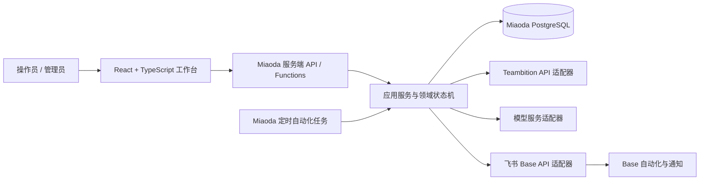
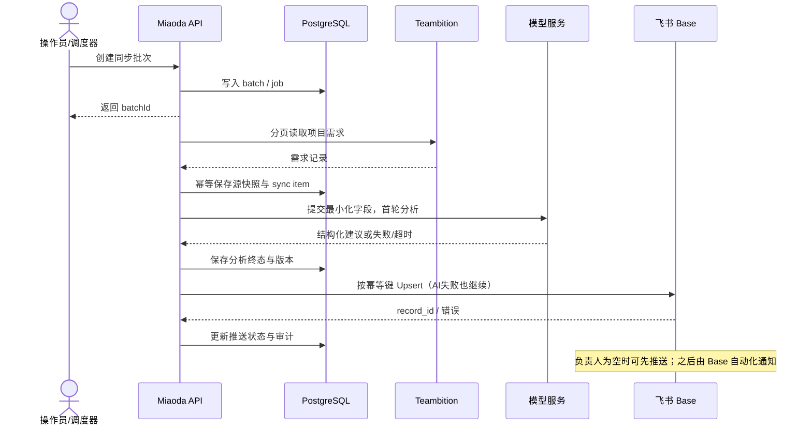

# RQ-Sys MVP 技术方案（妙搭优先）

- 状态：建议方案，待目标妙搭应用 POC 验证
- 日期：2026-10-08
- 产品范围基线：`specs/rq-sys-mvp/README.md`（PRD revision 60）
- 技术约束：`specs/rq-sys-mvp/00-foundation-and-data-contract.md`、`05-platform-reliability-security.md`

## 1. 结论

建议以 **TypeScript 为主语言**：若 GitHub 仓库的实际技术栈兼容，前端采用 React + Vite + React Router；后端部署在妙搭应用中，按**模块化单体**组织业务服务和异步任务；业务数据优先使用妙搭应用提供的 PostgreSQL。Teambition、飞书多维表格和模型服务都放在服务端适配器后面。

这个方案适配 10 人以内、单项目的 MVP，避免先承担微服务的部署和运维成本。它是基于需求范围和先前原型做出的建议，不代表 GitHub 仓库现状。运行时和调度器选择仍以目标租户 POC 为准，不能把公开介绍当成当前应用已具备的实测证据。

## 2. 代码现状与范围

已删除的本地前端原型曾使用 React 19、TypeScript、Vite、React Router 7、Tailwind CSS 4 和 shadcn/Base UI，页面数据来自 mock 文件，没有生产后端。仓库顶层不是 Git 仓库；当前本地工作区不含用户给出的 GitHub 实现仓库。

本次无法从当前执行环境读取用户给出的 GitHub 仓库：GitHub 页面抓取未命中，命令行访问也因 DNS 无法解析而失败。因此本文根据本地前端快照和现有 Spec 制定；开始改代码前要把此建议与 `jiahao89/magene-rqsys` 的实际目录、Miaoda 导入方式核对。

MVP 继续遵守这些边界：

- 单个产品组 Teambition 项目；首次全量、之后每周和手动同步。
- 需求键使用 Teambition 项目 ID + 需求 ID；成功项不因其他条目失败而回滚。
- AI 输出模块建议、整体高/中/低置信度及理由/证据、U/M/S/C 建议；没有已发布规则版本时优先级留空。
- AI 低置信度或失败不拦截推送；AI 首次结果进入终态后工作流可以继续，后续重试独立运行。
- 飞书多维表格负责 PM 处理状态和自动化通知，Web 不回读 PM 状态。
- 不把上游 28 个字段整体搬进 MVP。

## 3. 技术选型建议

### Runtime and capability status

This section is the environment-specific addendum to the platform recommendation. It separates local source/runtime evidence from the still-unverified target Miaoda runtime.

| Capability | Local evidence (verified) | Target Miaoda evidence |
|---|---|---|
| Spark app inventory/read | `lark-cli apps +list --as user` succeeded and listed two apps; target RQ-Sys app is not among them. | No RQ-Sys app inspected. This does not establish scheduler, database, logs, or write access. |
| Existing app detail | `apps +get --app-id app_17f41y3cs26 --as user` succeeded. | Not evidence about RQ-Sys target runtime. |
| Collaborator read | `apps +member-list` on existing frontend app returned OpenAPI 3340005 `feature_not_available`. | This app/resource does not support collaborator management via lark-cli; no inference about other read methods. |
| Local API runtime | Typecheck/build/test passed. `/api/health` => 200; `/api/health/ready` => 503 because no local database URL is configured. | Node/server entrypoint, database, identity, secrets, scheduler/background task, Git import/publish remain unverified. |

The earlier 2026-10-08 TRAE authorization-service report that Spark scopes were unsupported remains evidence about that authorization service only. A later lark-cli app-list success shows partial current Spark read capability; do not generalize either result to untested API surfaces or to TRAE itself.

| 层 | 建议 | 原因与边界 |
|---|---|---|
| 前端语言 | TypeScript | 当前前端已采用；与服务端共享请求/响应契约，降低类型漂移。运行时仍需在妙搭 POC 中确认。 |
| 前端框架与构建 | 推荐 React + Vite + React Router 7，先采用 CSR SPA（以 GitHub 仓库核对为前提） | 工作台没有公开 SEO 页面，Miaoda 承担服务端 API。React 官方对新建项目建议优先考虑框架；React Router 7 也可与 Vite 组成全栈框架。若 GitHub 仓库已有成熟框架，优先延续；若后续要求 SSR/Server Components，再验证妙搭部署兼容性，不预先引入第二套服务端。 |
| UI 组件 | 暂不定；以实际 GitHub 仓库和 Figma 为准 | `design.md` 与现有技术设计写的是 HeroUI v3；已删除的原型曾使用 shadcn/Base UI。实现前检查目标仓库，并选择一套组件库，避免混用。 |
| 服务端语言/运行时 | TypeScript；使用妙搭应用实际支持的服务端运行入口 | 与前端统一语言，Teambition/飞书/模型 API 都是 I/O 集成型工作。先使用妙搭原生后端能力；仅当确认其需要标准 HTTP 进程时，再选择 Fastify 等框架，不预装 NestJS。 |
| 架构形态 | 单应用、模块化单体 + 持久化后台任务 | MVP 体量和团队规模不需要微服务；按领域边界隔离 provider、状态机和持久化，未来可以逐模块迁移。 |
| 数据库 | 妙搭应用 PostgreSQL + ORM/迁移机制（目标环境验证后确认） | 需求快照、历史、批次和映射是关系数据；需要唯一约束、事务、索引和可靠持久化。不要把本地 SQLite 文件作为妙搭生产存储。 |
| 任务调度 | 首选妙搭自动化任务；任务状态/条目状态落 PostgreSQL | 妙搭官方资料介绍可配置定时任务并执行应用代码。仍需实测时区、执行时限、重复触发、失败记录、并发和重试能力。 |
| 前端服务端状态 | 使用 TanStack Query 管理 API 缓存、刷新和变更失效；简单表单状态保留在组件/表单层 | 工作台需要查看批次进度、阶段状态和重试结果。只在需要异步服务端状态时使用，不额外引入 Redux。 |
| API 契约校验 | 服务端校验为准；TypeScript DTO 与 Zod schema 可放共享契约模块 | 浏览器校验只改善体验，权限和业务校验必须在服务端重复执行。避免前后端各自维护不同枚举。 |
| 认证与授权 | 复用妙搭/飞书身份；每个服务端入口都做角色和资源授权 | 仅用前端隐藏按钮不构成授权。若妙搭无法可靠提供操作者身份，需要在 POC 阶段确定替代认证方式。 |
| 日志与审计 | 妙搭日志用于运行诊断；业务审计事件长期落业务数据库 | 日志和审计不是同一数据；API token、个人 ID、电话邮箱必须脱敏。 |

React 官方建议新项目优先使用框架，并列出 React Router 7 与 Vite 的组合；当前仓库已经是 React Router + Vite，且工作台没有公开 SEO 页面、后端计划由妙搭承载，因此建议先保留 CSR SPA，把边界控制在一个前端和一个妙搭后端。[React：Creating a React App](https://react.dev/learn/creating-a-react-app)

## 4. 逻辑架构



关键约束：

1. Web 只访问应用 API，不接触 Teambition/飞书/模型密钥，也不直连数据库。
2. 手动同步和每周任务调用同一个 `runSync` 用例，避免两套同步规则。
3. 外部服务都通过接口注入，例如 `TeambitionClient`、`BaseClient`、`AnalysisProvider`；切换提供方不改变状态机。
4. 状态迁移由服务端用例控制；AI 只生成建议数据，不能决定是否采纳，也不能覆盖 PM 确认值。
5. Base 自动化是通知责任方的机制；RQ-Sys 记录 Base 推送结果，不虚报通知已送达。

## 5. 后端模块边界

- `source-config`：来源项目、负责人名单、同步计划和凭证自检。
- `sync`：手动/定时触发、分页读取、源字段标准化、差异检测、批次和条目状态。
- `analysis`：PII 最小化、模型请求/响应 schema 校验、分析版本、超时与重试。
- `owner-mapping`：按 TB user ID 优先、唯一姓名次之；不确定时进入人工映射。
- `base-push`：字段白名单、幂等 Upsert、PM 字段快照、负责人写入。
- `dictionary-rules`：受控模块词典、优先级规则版本和发布记录。
- `audit`：操作人、对象、动作、时间、结果和安全错误信息。
- `jobs`：定时触发、持久化执行状态、租约/并发保护和重试入口。

服务端目录最终形式服从妙搭导入/运行约束；先稳定逻辑边界，不为“标准分层”强行拆成多个服务或多个部署单元。

## 6. 持久化和异步执行

业务数据建议按 Spec 00 建立以下逻辑实体：`source_config`、`sync_batch`、`sync_item`、`requirement_map`、`source_snapshot`、`analysis_run`、`person_map`、`pm_snapshot`、`workflow_history`、`audit_event`、`module_dictionary`、`priority_rule_version`。实际表名和 ORM 类型以妙搭能力和迁移方案验证后确定。

### 执行规则

- 唯一键：`(teambition_project_id, teambition_requirement_id)`。
- 批次与条目分开记录；条目失败不回滚成功项。
- 使用持久状态驱动步骤，不依赖一次 HTTP 请求保持数分钟。手动触发 API 创建批次并返回 `batchId`，界面通过查询批次详情获取进度。
- 调度器可能重复触发，因此同步、AI、推送都需要各自的幂等键和阶段状态。
- 同一来源同一时刻只允许一个有效同步租约；租约过期后允许恢复或安全重试。
- 如果妙搭自动化任务无法保证重启恢复，数据库中的 batch/item/job 状态仍是恢复依据；另评估妙搭支持的持久任务机制，不能以本地内存队列替代。

### 首轮同步主流程



## 7. 前端代码组织建议

保持页面级路由，把业务交互按 feature 收拢，减少跨页面重复请求逻辑：

```text
src/
  app/                 # 路由、Providers、全局错误边界
  features/
    sources/           # 来源配置、自检、手动同步
    batches/           # 批次列表、详情、重试
    requirements/      # 需求详情、AI 建议、负责人映射
    rules/             # 模块词典和规则版本
    audit/             # 审计查询
  components/ui/       # 目标仓库选定的组件库
  lib/api/             # fetch client、错误解析、DTO schema
  lib/auth/            # 当前操作者、角色能力
```

服务端数据由 query hooks 获取；按批次和需求维度设计 query key，重试/映射/配置 mutation 成功后失效相关 key。加载、空数据、处理中、部分失败、不可重试错误均有页面状态。不要把 mock 数据和真实 API 混在业务组件内；本地演示与生产都走同一 API client，分别注入 mock/real adapter。

## 8. 外部 API 与安全

- Teambition、Feishu Base 和模型 API 只由服务端调用；凭证不出现在浏览器构建产物、前端日志或配置查询响应中。
- 按既有决定保留硬编码 Teambition API-key fallback，但限定在服务端 helper 中；保留脱敏和不可回显要求，并安排凭证轮换策略。
- Feishu Base 写入使用字段 allowlist；PM 字段变更前先读取快照，快照失败就不覆盖记录。
- 模型输入限于 Spec 02 的必要字段；去除人员 ID、姓名和联系方式，不发送附件内容。
- 输出用 schema 和枚举校验；无法校验的输出记为分析失败，保留安全错误码和可重试性。
- 运维日志保留期限按妙搭实际配置；完整工作流审计单独持久化，遵从组织数据策略。妙搭官方介绍当前运行日志有 30 天留存；不可把它当作业务审计的长期存储。[妙搭任务与日志介绍](https://www.feishu.cn/content/article/7592171136612306139)

## 9. GitHub 与妙搭协作方式

建议 GitHub 仓库作为唯一代码事实来源，妙搭作为开发/运行和发布环境。必须通过 POC 确认目标租户支持的代码导入、导出、发布、回同步和分支协作方式。妙搭官方资料提及 ZIP 和部分外部项目导入能力，但不能据此推断用户给出的 GitHub 仓库已可双向同步。[妙搭代码项目导入介绍](https://www.feishu.cn/content/article/7597741503372512473)

在确认同步方向之前，不要同时在 GitHub 与妙搭编辑同一份代码。推荐流程：

1. 获取并检查 GitHub 仓库，确认当前分支与改动后创建 feature branch；先保留其现有实现。
2. 在本地/Trae/Codex完成一个 ticket 范围内的提交和检查。
3. 将指定分支/构建产物导入妙搭预览环境；确认部署引用的 commit。
4. 验证通过后合并到主分支，再按同一流程发布。
5. 若妙搭不支持直接跟踪分支，就明确“GitHub 为源码、妙搭为发布目标”，使用导出包或平台支持的导入方式，不在妙搭里维护一份长期分叉代码。

## 10. 先做的 POC 和技术验收

### POC 必须确认

1. **应用代码**：GitHub 项目能否导入妙搭；导入后目录/依赖/构建入口和变更回同步路径。
2. **服务端 TypeScript**：实际代码入口、运行时版本、HTTP/API 暴露和认证上下文。
3. **PostgreSQL**：是否由当前应用开通；ORM 连接、唯一约束、事务、迁移、索引和持久化是否可用。
4. **定时任务**：每周任务能否调用应用代码；时区、重复触发、超时上限、重试、并发、失败记录和线上启停。
5. **Secret 与身份**：Teambition/Feishu/model 凭证的服务端注入、轮换、日志脱敏；用户身份和服务端权限校验。
6. **外部网络**：妙搭生产运行时是否可访问 Teambition、飞书 OpenAPI 和获批模型服务的 HTTPS 域名。

### MVP 开发顺序

1. 先完成妙搭环境与 Git 工作流 POC，冻结部署边界。
2. 建持久化模型、API 契约和手动 Teambition 同步，移除该流程对 mock 数据的依赖。
3. 接入 AI provider，展示分析状态/结果/失败；推送流程能在 AI 首次终态后继续。
4. 接负责人映射和 Feishu Base Upsert，验证快照、PM 字段保护与 Base 自动化。
5. 打通定时调度、失败重试、并发保护和审计。
6. 用目标妙搭环境进行端到端验收后，再扩大字段或 Roadmap 能力。

## 11. 决策状态

| 决策 | 建议状态 | 下一步证据 |
|---|---|---|
| TypeScript + React + Vite 前端 | 建议采用；若 GitHub 仓库已有成熟栈则优先评估延续 | 读取 GitHub 实际前端并在目标妙搭导入后冻结 |
| UI 组件库 | 待定；`design.md` 当前指向 HeroUI v3，已删除原型使用 shadcn/Base UI | 检查 GitHub 仓库与 Figma 后记录一套生产基线 |
| TypeScript 模块化单体后端 | 建议采用 | 妙搭运行时 POC 验证语言、API 和 ORM |
| 妙搭 PostgreSQL | 首选方案 | 当前应用租户中验证并确认配额/迁移能力 |
| 妙搭定时自动化任务 | 首选方案 | 目标应用中验证失败恢复、重试和并发限制 |
| 模型服务 | 暂不指定 | 先批准供应方和数据策略，再做 POC |
| GitHub 与妙搭双向同步 | 不预设支持 | 核实导入/导出/回同步后再定发布流程 |

## 12. 资料来源

- 飞书官方《飞书妙搭：AI原生系统搭建工具》：介绍妙搭全栈应用、Serverless PostgreSQL/ORM、定时自动化任务和运行日志能力。https://www.feishu.cn/content/article/7592171136612306139
- 飞书官方《飞书妙搭重磅上新》：介绍数据库管理、索引/权限能力和代码项目导入。https://www.feishu.cn/content/article/7597741503372512473
- React 官方应用创建指南：https://react.dev/learn/creating-a-react-app
- TanStack Query React 文档：https://tanstack.com/query/latest/docs/framework/react
